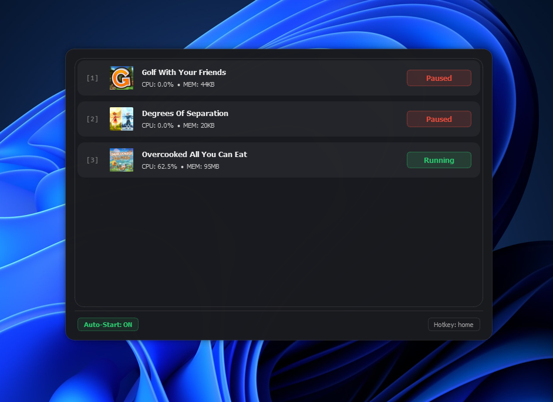

# 🎮 Windows Game Quick Resume

> Xbox-style Quick Resume for games and apps on Windows.

**Windows Game Quick Resume** brings the **Xbox Quick Resume experience** to PC, allowing you to pause games and heavy applications and instantly resume them later — without reopening, reloading, or losing state.

Built for PC gamers who constantly switch between games, tools, and performance-heavy apps.

---

## ✨ What is this?

- 🕹️ **Pause and resume games instantly**
- 🧠 **Reduce RAM, GPU and CPU usage while paused**
- ⚡ **Fast overlay controlled by a hotkey**
- ⌨️ **Quick switching using number keys (1–9)**
- 🪟 **Minimal, always-available overlay**
- 🚀 **Instant resume, zero reloads**

Think of it as **Quick Resume for Windows games and apps**.

---

## 🎮 Inspired by Xbox Quick Resume

On Xbox Series consoles, Quick Resume allows you to jump between games exactly where you left off.

> ⚠️ This is an independent project. Not affiliated with Microsoft or Xbox.

---

## 📸 Demo

---

## ⌨️ Controls

- **Global hotkey:** `F12` (configurable)
- **Number keys (1–9):** Instantly toggle listed games/apps
- **Click on an app:** Pause / Resume
- **System tray icon:** Background control

---

## ▶️ How to use (EXE version)

1. Download the latest version from **Releases**
2. Run the `.exe` **as Administrator**
3. Press `F12` to open the overlay
4. Pause and resume your games or apps instantly

> ⚠️ Administrator privileges are required to suspend processes.

---

## ⚙️ Requirements

### ▶️ Using the compiled `.exe`
- Windows 10 or Windows 11 (64-bit)
- Administrator privileges

✅ No Python installation required  
✅ No dependencies to install  

---

### 🧑‍💻 Using the source code
- Windows 10 or Windows 11 (64-bit)
- Python 3.10+
- Administrator privileges

Install required Python libraries:

pip install psutil pyqt5 keyboard pywin32

## ⚠️ Important notes & limitations

- The overlay only lists **apps and games that are currently using a minimum amount of CPU**.
- Applications that are completely idle, minimized, or not actively running may **not appear immediately**.
- This is intentional behavior, designed to avoid clutter and focus on relevant, active processes.
- Do **not** suspend critical system processes.
- Suspending some online or multiplayer games may cause disconnects.
- Use at your own risk.

Recommended for:
- Single-player games
- User-level applications
- Heavy apps you frequently switch between
